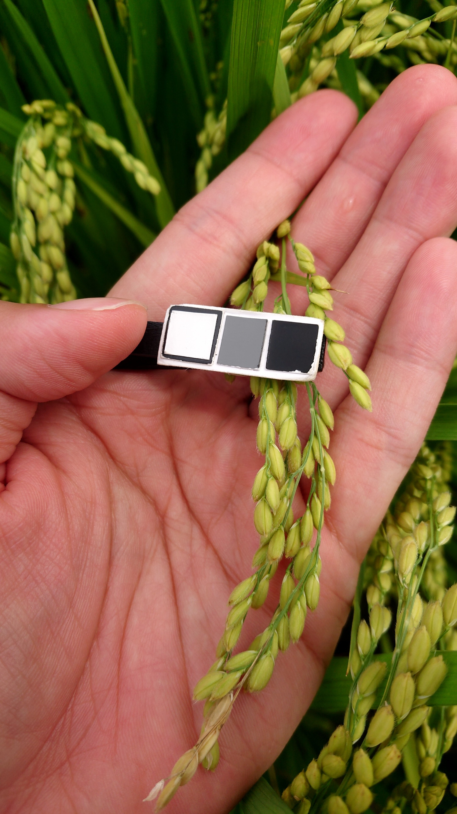
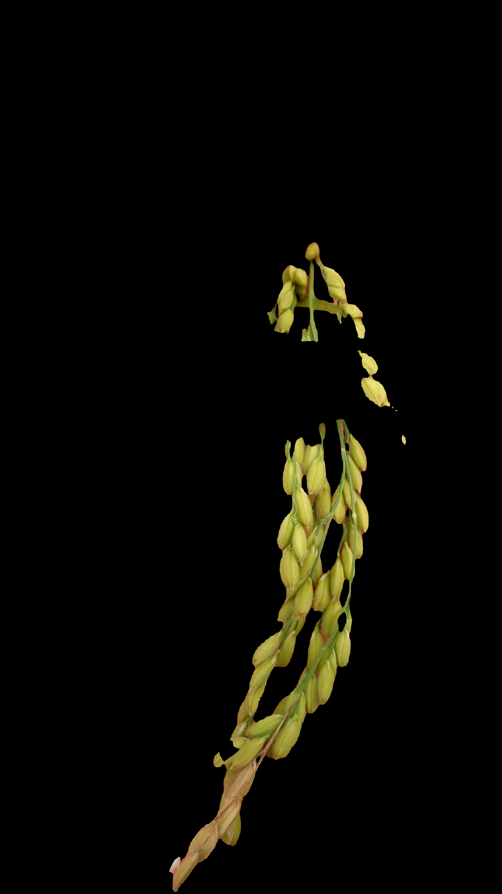
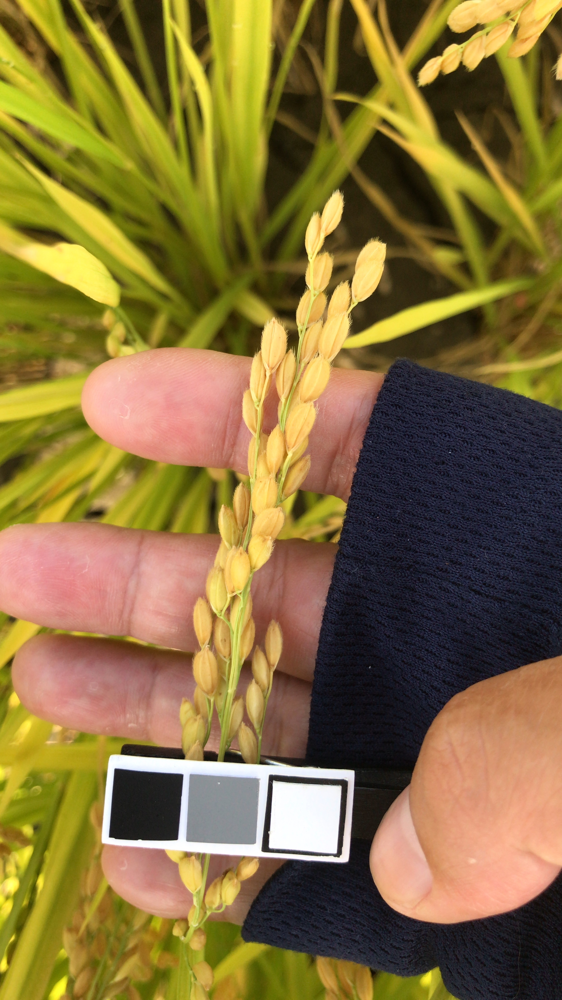
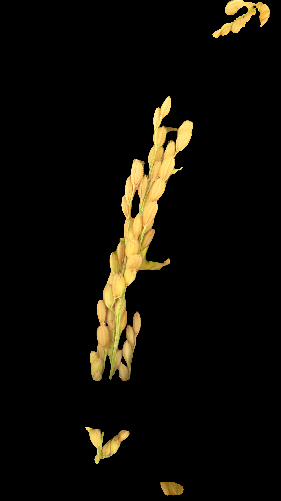

# 專案名稱

## 介绍

> 說明 : 簡短介紹專案

這個專案基於 U2-Net 架構，旨在應用於從手機拍攝的圖像中提取稻穗圖像並去除背景。這個預處理方法可用於進一步分析，如估計穀物的含水量。由於 U2-Net 在背景去除的圖像分割任務方面表現出色，因此選擇了基於這個架構訓練去背模型。

## 功能

> 說明 : 簡潔而清晰地描述的專案能夠做什麼。說明專案的主要功能，使用者能透過這個 AI 模型，功能部分可以列出您的專案或應用程式提供的主要功能和特點

- 使用 U2net 模型進行稻穗圖像分割和背景去除
- 功能 2
- 功能 3

## 呈現效果

> 將輸入資料與輸出資料進行呈現，讓使用者更快速瞭解模型的功用

|                       原始圖片(稻穗去背前)                       |                          推論結果(稻穗去背後)                           |
| :--------------------------------------------------------------: | :---------------------------------------------------------------------: |
|  |  |
|  |  |

## 資料集

> 說明 : 資料集描述，例如圖片數量、大小、格式；資料欄位、標籤、類型等

這個專案使用了一個名為 [資料集名稱] 的資料集，它包含了 [資料集描述]，[例如類別數量、圖片數量等]。

## 自訂資料集

> 說明 : 告訴使用者，使用自訂資料集需注意的事項與規範

如果希望使用自訂資料集，你需要準備一個符合特定格式的資料集。
[資料的格式要使用 jpg、資料標籤步驟、資料集大小、自訂資料集應該要怎麼存放]。

## 安裝

> 說明 : 需要安裝哪些軟體， WSL、Docker 或其他相關套件、模組、應用程式等

請確先安裝 [WSL](https://learn.microsoft.com/zh-tw/windows/wsl/install) 及 [Docker Desktop](https://www.docker.com/products/docker-desktop)，並確保 Docker Desktop 可以順利運行。

## 使用

### 在 Windows 上執行

> 說明 : 講解一下怎麼使用，執行前要先打開哪些軟體，在執行 batch 檔後，後會執行哪些步驟，哪些事項是使用者需要注意的

請將 Docker Desktop 開啟後再執行 `start.bat`。

    打開 `start.bat` 文件。

執行 `start.bat` 後會自動進行映像檔載入、詢問資料儲存路徑、推論等操作。

## 原始碼

> 說明 : 如果願意請提供原始專案 GitHub 網址，讓想針對這個議題的使用者能夠參考

若對原始專案有興趣想要深入了解，可以前往 [GitHub](https://github.com) 參考。

## 參考文獻

> 說明 : 提供此專案的相關技術參考資料

如果你想深入研究模型架構或相關技術，可以參考以下參考文獻 :

- [Ｕ2-Net](https://github.com/xuebinqin/U-2-Net) GitHub 網址
- 參考文獻 2
- 參考文獻 3

## 聯絡方式

> 說明 : 提供個人聯絡方式

聯絡人 : 王 XX

Email : your_email@example.com

個人網站 : htts://myblog_or_website.com
