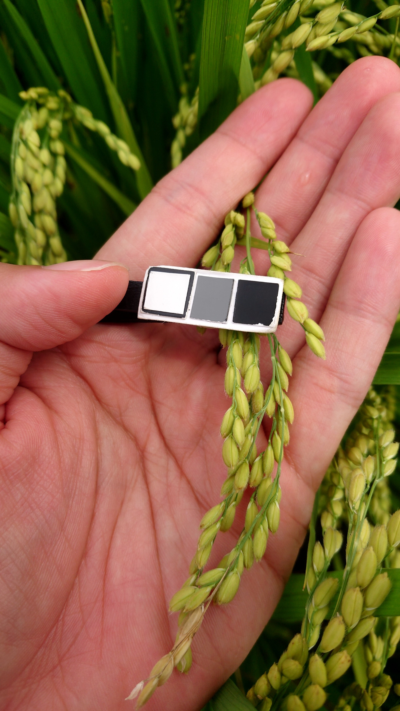
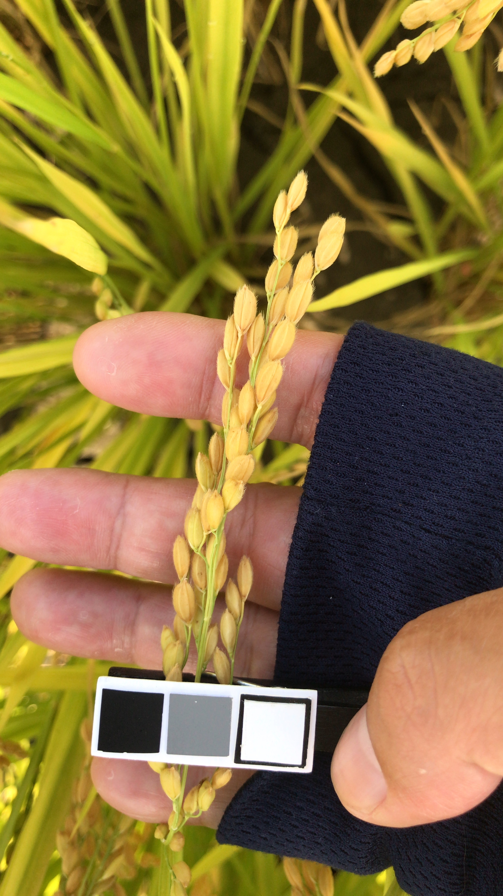

# 專案名稱

## 介绍

> 簡短介紹專案

這個專案基於 U<sup>2</sup>-Net 架構，旨在應用於從手機拍攝的圖像中提取稻穗圖像並去除背景。這個預處理方法可用於進一步分析，如估計穀物的含水量。由於 U<sup>2</sup>-Net 在背景去除的圖像分割任務方面表現出色，因此選擇了基於這個架構訓練去背模型。

## 功能

> 簡潔而清晰地描述的專案能夠做什麼。說明專案的主要功能，使用者能透過這個 AI 模型，功能部分可以列出您的專案或應用程式提供的主要功能和特點

- 使用 U<sup>2</sup>-Net 模型進行稻穗圖像分割和背景去除
- 功能 2...
- 功能 3...

## 呈現效果

> 將輸入資料與輸出資料進行呈現，讓使用者更快速瞭解模型的功用

|                       原始圖片(稻穗去背前)                       |                          推論結果(稻穗去背後)                           |
| :--------------------------------------------------------------: | :---------------------------------------------------------------------: |
|  |  |
|  |  |

## 模型

> 根據專案的模型撰寫模型架構、訓練方式、模型評估、AI 可視化等

### 模型架構

模型採用了以下架構 :

- 層數: [層數]
- 節點數: [節點數]
- 激活函數: [激活函數]


### 訓練方式

模型是使用以下方式進行訓練的 :

- 訓練數據: [訓練數據集描述]
- 損失函數: [損失函數]
- 優化器: [優化器]
- 訓練批次大小: [批次大小]
- 學習率: [學習率]

### 預訓練權重

模型使用了預訓練權重，來源於 [預訓練模型]()。你可以在 [連結到預訓練模型的來源]() 下載這些權重。

### 模型評估

模型經過評估，並在測試數據上達到以下性能 :

- 精度: [精度值]
- 召回率: [召回率值]
- F1 分數: [F1 分數]

### 可視化

使用 Grad-CAM 技術進行視覺化，以產生模型對稻穗區域的注意力熱圖，並進行解釋。

|   層    |                                 圖片                                  |
| :-----: | :-------------------------------------------------------------------: |
|  side1  |      |
|  side2  |      |
|  side3  |      |
|  side4  |      |
|  side5  |      |
|  side6  |      |
| outconv |  |

## 資料集

> 資料集描述，例如圖片數量、大小、格式；資料欄位、標籤、類型等

這個專案使用了一個名為 [資料集名稱] 的資料集，它包含了 [資料集描述]，[例如類別數量、圖片數量等]。

## 自訂資料集

> 告訴使用者，使用自訂資料集需注意的事項與規範

如果你希望使用自訂資料集，你需要準備一個符合特定格式的資料集。
[資料的格式要使用 jpg、資料標籤步驟、資料集大小、自訂資料集應該要怎麼存放]

## 安裝

> 說明 : 需要安裝哪些套件、環境、版本等

使用前請先安裝好 [Anaconda](https://www.anaconda.com/download)。

### Anaconda

啟動終端機依照以下說明輸入指令

建立新的 Python 虛擬環境，Python 版本 >= 3.8

```bash
# ENV_NAME 為自訂的環境名稱
conda create -n ENV_NAME python=3.9
```

啟動環境

```bash
# ENV_NAME 為自訂的環境名稱
conda activate ENV_NAME
```

安裝相關套件

```bash
# 安裝 pip
conda install pip
# 切換目錄到專案資料夾
cd 專案資料夾
# 安裝專案所需套件
pip install -r requirements.txt
```

## 使用

> 說明 : 講解一下怎麼使用，如何自己訓練模型、推論，要執行哪一個程式檔案，資料集放置處。

### 訓練

訓練模型前請先確保資料集已經請放在 dataset 目錄下，並且按照[自訂資料集的規範](#自訂資料集)。

```bash
# 切換目錄到專案資料
cd 專案資料夾
# 執行訓練程式
python src/train.py
```

### 推論

推論會將執行結果輸出在 result 資料夾

```bash
# 切換目錄到專案資料
cd 專案資料夾
# 執行推論程式
python src/main.py
```

## 參考文獻

> 說明 : 提供此專案的相關技術參考資料

如果你想深入研究模型架構或相關技術，可以參考以下參考文獻 :

- [Ｕ<sup>2</sup>-Net](https://github.com/xuebinqin/U-2-Net) GitHub 網址
- [Grad-CAM](https://github.com/jacobgil/pytorch-grad-cam) GitHub 網址
- 參考文獻 3

## 聯絡方式

> 說明 : 提供個人聯絡方式

聯絡人 : 王 XX

Email : your_email@example.com

個人網站 : htts://myblog_or_website.com
